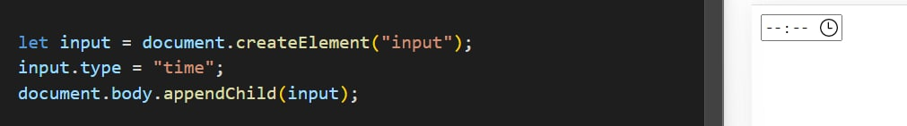

# DOM-2
#
## createELement()
### В документе HTML метод document.createElement() создает элемент HTML, указанный в tagName

#
## appendChild()

#
## classChild()
## add()

## remove()

## toggle()

## contains()

#
## setAtributte()
